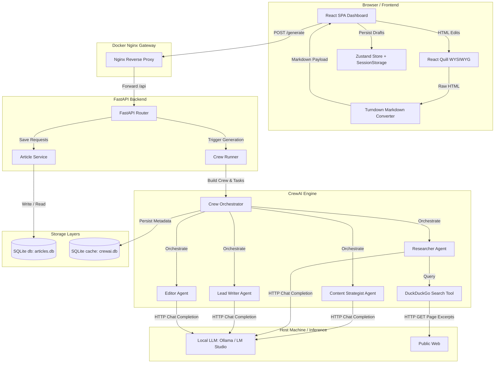

# Case Study: Local Article Studio
## Architectural and Engineering Design Patterns in Agent-Driven Content Orchestration

### Executive Summary

**Local Article Studio** is a self-contained, containerized workstation designed for automated, high-quality article generation and interactive revision. It employs a multi-agent system (powered by **FastAPI** and **CrewAI**) collaborating with local Large Language Models (LLMs) like **Ollama** or **LM Studio** to perform domain-specific strategy, research, drafting, and editorial review. 

By leveraging a decoupled client-server architecture, standard SQL databases, custom scraping tools, and a dynamic configuration model, the application successfully transitions AI agents from simple chat interfaces to structured, predictable software delivery pipelines.

---

### Architectural Overview

Local Article Studio is structured into three primary tiers:

1. **Presentation Layer (React Single Page Application):** Built using React, Vite, and Tailwind CSS. It features a WYSIWYG rich text editor (**React Quill**) and provides interfaces for managing content generation prompts, viewing real-time agent output, rolling back drafts via a session-cached history, and tracking source bibliography notes.
2. **Orchestration Layer (FastAPI Backend + CrewAI):** A lightweight Python server that exposes REST endpoints for generating, regenerating, and saving articles. It instantiates dynamic multi-agent "crews" based on user requirements and coordinates data flow between tasks.
3. **Data & AI Infrastructure:** Consists of **SQLite** (via SQLAlchemy ORM) for article storage, **DuckDuckGo API** for live web retrieval, and a local or cloud-based OpenAI-compatible API host (e.g., **Ollama** or **LM Studio**) to run inference.

#### System Topology and Network Data Flow



---

### Core Engineering Decisions

#### 1. Data-Driven Agent Persona Configuration
Instead of hardcoding agent behaviors, prompts, or roles directly into Python execution blocks, Local Article Studio implements a highly extensible **data-driven persona system** via [topic_factory.py](file:///c:/Users/milli/content_writing_ai_agents/content_writers/backend/app/services/topic_factory.py). 

Domain presets (e.g., `tech_news`, `real_estate`, `esoteric_philosophy`) specify:
- The target **Audience**
- Brand-appropriate **Style Guides**
- Custom **Search Focuses**
- Individual **Persona Configs** (role, goal, backstory) for each agent in the loop.

This separation of concerns enables developers to introduce new content channels or fine-tune brand voices without modifying the backend execution engine or endpoints.

---

#### 2. Isolation of CrewAI Caching and Runtime Storage
By default, CrewAI creates local storage files (like SQLite database files for state-saving, task histories, and usage telemetry) in generic system folders or the root execution directory, cluttering the project structure. 

To solve this, the orchestrator implements a **storage runtime patch** at startup inside [runner.py](file:///c:/Users/milli/content_writing_ai_agents/content_writers/backend/app/crew/runner.py#L161-L173):

```python
def _patch_crewai_storage(self, storage_dir: Path) -> None:
    def storage_path() -> str:
        return str(storage_dir)

    import crewai.events.listeners.tracing.utils as tracing_utils
    import crewai.flow.persistence.sqlite as flow_sqlite
    import crewai.memory.storage.kickoff_task_outputs_storage as kickoff_storage
    import crewai.utilities.paths as crew_paths

    crew_paths.db_storage_path = storage_path
    kickoff_storage.db_storage_path = storage_path
    flow_sqlite.db_storage_path = storage_path
    tracing_utils.db_storage_path = storage_path
```

By dynamically overriding the path resolvers in CrewAI memory and database modules, the system forces all temporary agent databases, traces, and artifacts into a centralized `.cache/crewai` directory. When deployed via Docker, this cached directory is mounted to a named volume, ensuring agent speed (via cache persistence) while keeping the host clean.

---

#### 3. Structured Excerpt Scraper (Deep Web Research Tool)
Standard search engine integrations only provide the LLM with short search snippets, which are often shallow or incomplete. Local Article Studio designs a custom CrewAI `BaseTool` called `DuckDuckGoSearchTool` in [tools.py](file:///c:/Users/milli/content_writing_ai_agents/content_writers/backend/app/crew/tools.py) that extends research beyond raw search engines:

- **Snippet Gathering:** Resolves the query against DuckDuckGo.
- **Deep Fetching:** Programmatically fetches the top $N$ landing pages (defaulting to 3) asynchronously using `httpx`.
- **Content Excerpting:** Strips scripts, style blocks, and HTML markup. It returns the initial 500 characters of clean body text to the agent, alongside the URL and title.
- **State Capture:** Stores all accessed links in a private variable `_captured_sources` mapping to Pydantic schemas, enabling the API to return a full, deduplicated bibliography to the client dashboard.

---

#### 4. Bidirectional Content Parsing: WYSIWYG HTML vs. LLM Markdown
LLMs generate and structure content most effectively using Markdown syntax. However, humans require visual styling (headers, lists, bolding) to edit drafts comfortably. 

To bridge this gap:
- **FastAPI Backend** parses Markdown-it-rendered HTML using [draft_service.py](file:///c:/Users/milli/content_writing_ai_agents/content_writers/backend/app/services/draft_service.py) to provide the React frontend with both clean Markdown and a fully rendered HTML string.
- **React Frontend** loads the HTML into a **React Quill** editor.
- When saving drafts or requesting agent regeneration, the client uses `TurndownService` ([App.jsx](file:///c:/Users/milli/content_writing_ai_agents/content_writers/frontend/src/App.jsx#L34-L36)) to translate user HTML modifications back to clean ATX-style Markdown. This ensures that the agents always receive standardized Markdown input during revisions, preventing formatting leaks from degrading model performance.

---

#### 5. Long-Running Workflow Gateways (Nginx Timeouts)
AI agent chains involve multiple sequential LLM calls, tool interactions, and feedback loops. Generating a long-form article can easily take between 45 to 150 seconds, depending on the model's speed and system constraints.

Traditional web server setups (including default Nginx profiles) drop HTTP connections that exceed 60 seconds, returning a `504 Gateway Timeout`. To prevent premature disconnection during generation runs, the project configures explicit proxy timeout gates in [nginx.conf](file:///c:/Users/milli/content_writing_ai_agents/content_writers/frontend/nginx.conf#L20-L24):

```nginx
location /api/ {
    proxy_pass http://backend:8000/api/;
    ...
    proxy_connect_timeout 300s;
    proxy_send_timeout 300s;
    proxy_read_timeout 300s;
}
```

This ensures the HTTP tunnel remains open for up to 5 minutes, allowing complex agent reasoning cycles to complete and deliver results to the client UI.

---

#### 6. Microservices Networking (Docker Bridge to Host Local LLM)
When deploying apps via Docker Compose, containers operate inside an isolated Docker network bridge. However, users running local models via Ollama run them directly on their host operating system (localhost:11434).

To resolve this connectivity gap, the [docker-compose.yml](file:///c:/Users/milli/content_writing_ai_agents/content_writers/docker-compose.yml) file exposes the backend container to the host gateway:

```yaml
services:
  backend:
    ...
    environment:
      - LLM_BASE_URL=http://host.docker.internal:11434
    extra_hosts:
      - "host.docker.internal:host-gateway"
```

This mapping allows the containerized agents to query the local LLM running on the host workstation seamlessly.

---

### Agentic Workflow Design

The system runs two discrete workflows: the **Generation Pipeline** and the **Regeneration Loop**. Both are set up sequentially using `Process.sequential` to ensure clear ownership and strict quality gates.

```
[Generation Pipeline]
Strategist (Angle & Queries) ──> Researcher (Live DDG Excerpts) ──> Lead Writer (Drafting) ──> Editor (Final Polish)
```

```
[Regeneration Pipeline]
Researcher (Gap Analysis & Re-search) ──> Lead Writer (Targeted Redrafting) ──> Editor (Final Editorial Pass)
```

#### The Generation Pipeline ([tasks.py](file:///c:/Users/milli/content_writing_ai_agents/content_writers/backend/app/crew/tasks.py#L18-L96))
1. **Ideation & Alignment (Strategist):** Assesses the user's initial topic and constraints, chooses a specific content angle, formats a working title, and designs 3 custom search queries.
2. **Deep Fact-Checking (Researcher):** Executes the strategist's queries via the `DuckDuckGoSearchTool`, aggregates excerpts, and constructs a structured research dossier.
3. **Drafting (Writer):** Synthesizes the strategy brief and research dossier, focusing purely on narrative flow and clarity, producing a comprehensive markdown draft.
4. **Editorial Gate (Editor):** Polishes style and structure, removes AI-isms, ensures accurate source references, and outputs the final article.

#### The Regeneration Loop ([tasks.py](file:///c:/Users/milli/content_writing_ai_agents/content_writers/backend/app/crew/tasks.py#L99-L154))
When a user requests improvements based on feedback:
1. **Gap Analysis (Researcher):** Reviews the previous draft against the feedback. Runs new searches if required to resolve gaps, producing a targeted revision plan.
2. **Targeted Redrafting (Writer):** Amends the existing draft in-place based on the revision plan.
3. **Re-editing (Editor):** Standardizes tone and compiles the revised copy.

---

### Verification and Quality Controls

To ensure system reliability, the project runs a suite of automated unit and integration tests configured via `pytest` ([conftest.py](file:///c:/Users/milli/content_writing_ai_agents/content_writers/backend/tests/conftest.py)).

1. **Database & Cache Isolation:** Test configurations monkeypatch the `DATABASE_URL` and `CREWAI_STORAGE_DIR` to point to temporary folders (`tmp_path`), preventing tests from modifying local project databases.
2. **Module Reinitialization:** The test suite programmatically flushes imports from `sys.modules` before running tests. This ensures settings and database connections are rebuilt from mock environments, guaranteeing test isolation.
3. **Endpoint Validation:** Tests confirm input boundaries (e.g. invalid topic modules throw HTTP 400, missing LLMs throw HTTP 503, and payload validation failures return structured HTTP 422 JSON details).

---

### Conclusion

The architecture of **Local Article Studio** showcases how to wrap complex agentic systems with stable software engineering principles. By isolating runtime files, extending proxy timeout limits, handling clean formatting translations, and establishing strict data-driven profiles, the project serves as a robust blueprint for production-grade AI agent integrations.
